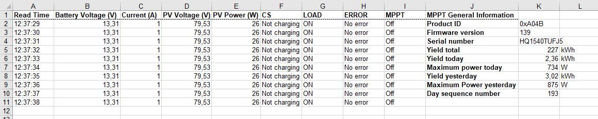

# VE MPPT Reader


vemppt_reader reads VE.Direct Protocol and registers values from MPPT Devices into xls files



## MPPT Connection


This software is tested with a [VE.Direct to USB Interface cable](https://www.victronenergy.com.es/accessories/ve-direct-to-usb-interface)


## Installation

vemppt_reader requires [pyserial](https://pypi.org/project/pyserial/) and [xlwt](https://pypi.org/project/xlwt/) to run


```sh

$ python -m pip install pyserial

$ python -m pip install xlwt

```

## How to start with vemppt_reader

You can test if you have installed all that vemppt_reader needs running vemppt_offtest.py (it will also generate a xls file)

To use vemppt_reader, run vemppt_main.py
> Before starting, make sure to put **the correct communication port** on it (in vemppt_main.py).

**To cancel any execution just use the terminate process order** `CTRL + C`

## VE.Direct Protocol Documentation

  - [VE.Direct Protocol - Version 3.25](https://www.victronenergy.com.es/download-document/2036/ve.direct-protocol-3.25.pdf)

  - [BlueSolar HEX protocol MPPT](https://www.victronenergy.com.es/download-document/4459/bluesolar-hex-protocol-mppt.pdf)
  
  - [MPPT Solar Charger Error Codes](https://www.victronenergy.com/live/mppt-error-codes)


## TO-DO List

  - Asynchronous message interpreter and register

## License
vemppt_reader is licensed under the GNU General Public License v3.0, detailed in the [LICENSE](https://github.com/AaronPB/vemppt_reader/blob/master/LICENSE) file.
